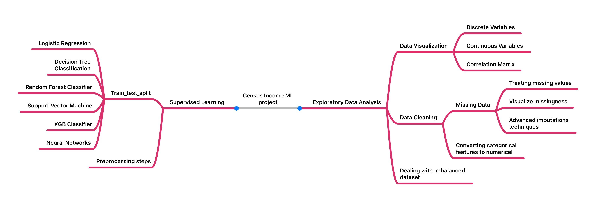

# Census-Income-Classification

## Description

The goal is to solve a binary classification task to determine whether a person makes over 50k a year. The heart of the project lies in the bayesian optimization application of the models hyperparameters I've implemented.
 
## Scope of the project 
The data for this project was taken from the UCI Machine Learning Repository : https://archive.ics.uci.edu/ml/datasets/census+income
 * Exploratory data analysis to understand the relationship between the features and the target variable
 * Processing, encoding and standardizing data into numerical features to use machine learning
 * Use predictive models to determine the individuals that are the most likely to make over 50k a year

## Mind mapping
I've built a mind map which summarizes my work :

